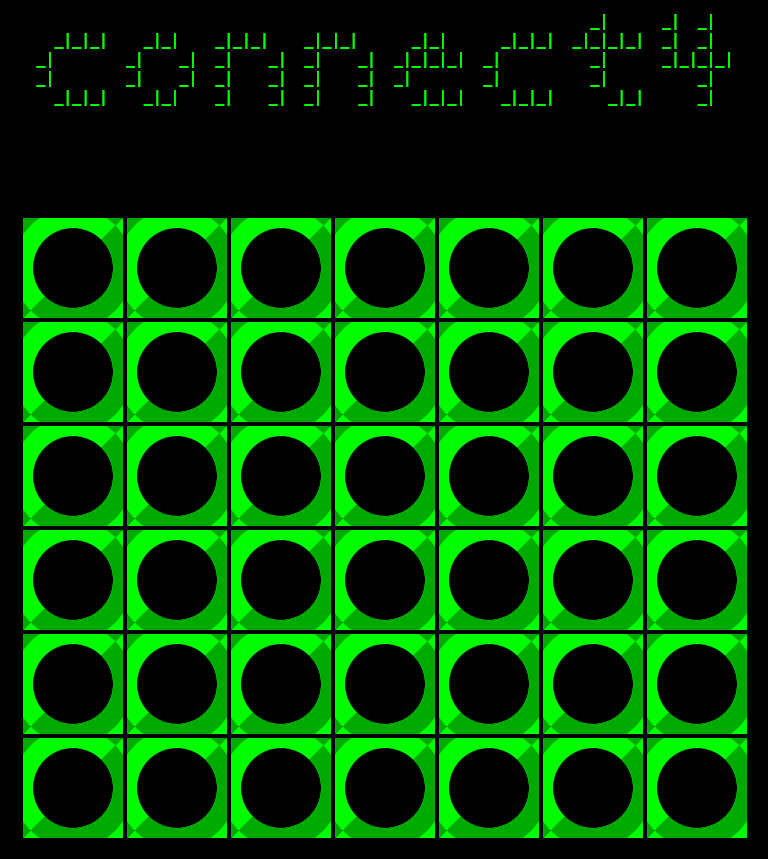

# Connect 4

"8-bit" styled take on a popular connection board game. Written as the first proper project at [SPICED Academy](https://www.spiced.academy/program/full-stack-web-development/). The core problem was developing an algorithm that would check for diagonal victories. Besides that, I've added a deus-ex-machina "SPICED" mode, which makes the gameplay more interesting for both players. Try it out!

---

## Preview

## Demo

https://connect-4.now.sh/

## Tech

HTML, CSS, jQuery

## Features

-   The board has six rows and seven columns

-   Two players take turns selecting a column to drop their checker into

-   The color of the title suggests which player takes turn

-   When a player wins, a message appears to announce the victory

-   (After a player wins) it's possible to reset the game and play again

-   optional SPICED mode: random checkers appear unexpectedly on the board

## Goals while doing the project

-   Learn to handle game logic in JS / jQuery and interactive elements

-   Make animations with CSS 
